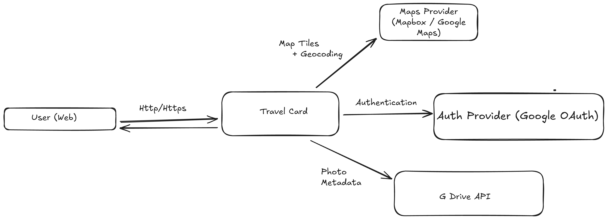
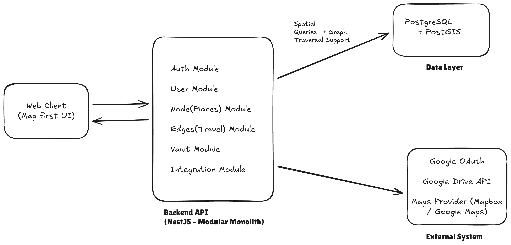
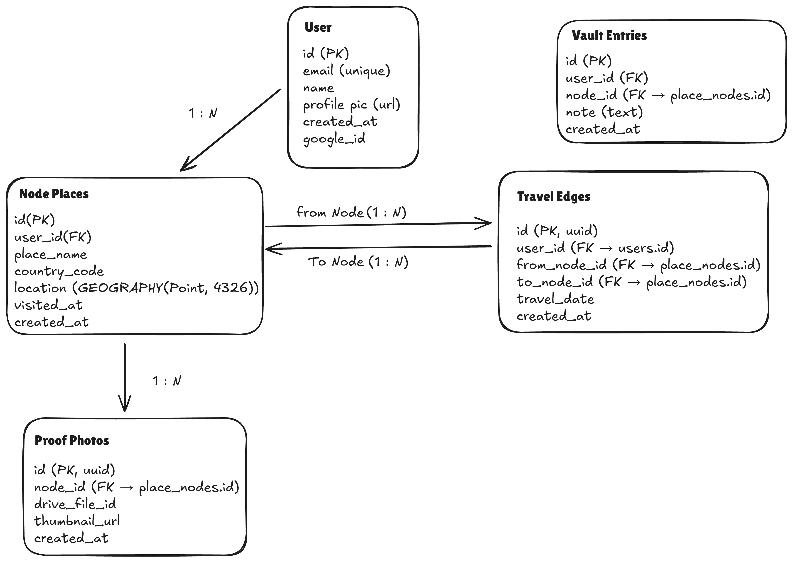

## Trace

## Tech Stack
- Next.js
- NestJS
- TypeScript
- PostgreSQL
- Prisma
- PostGIS

## Features
- User authentication (WIP)
- Travel place nodes
- Travel edges between places
- Place vaults for notes and photos

## System Context Diagram

The Travel Identity Map Platform is a map-first system where users
create verified place nodes backed by Google Drive photo references.



## High Level Design



## ER Diagram



## Development Setup

```bash
npm install
npm run start:dev

